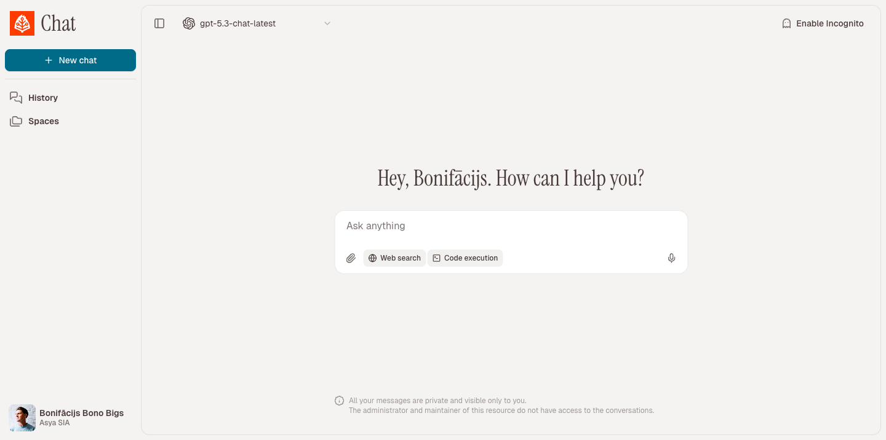
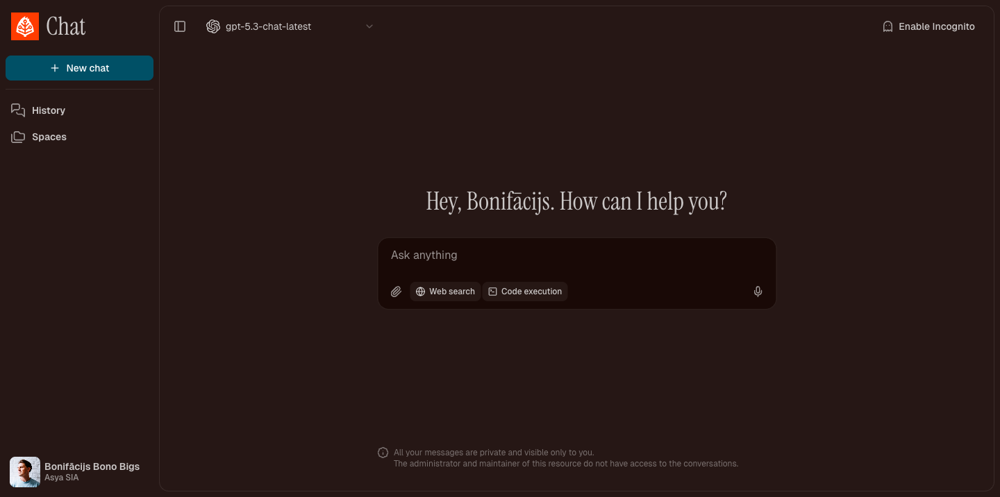
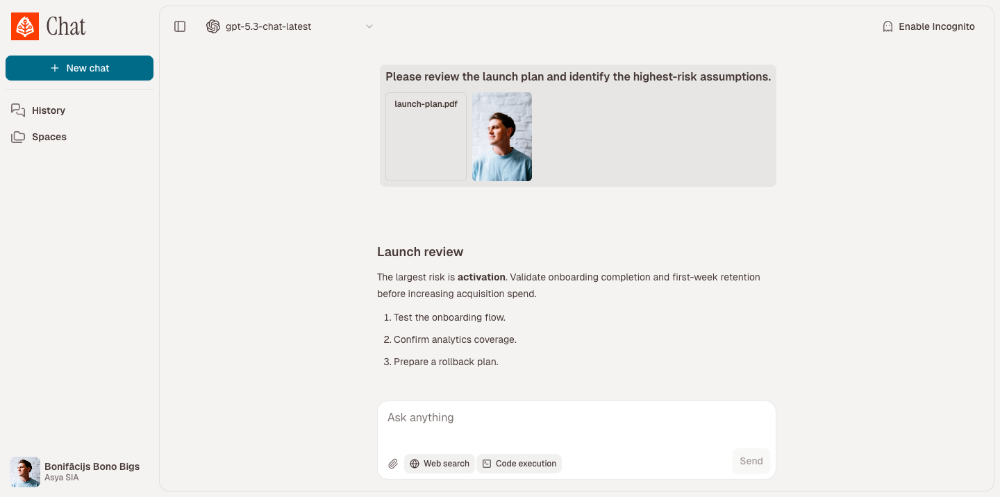
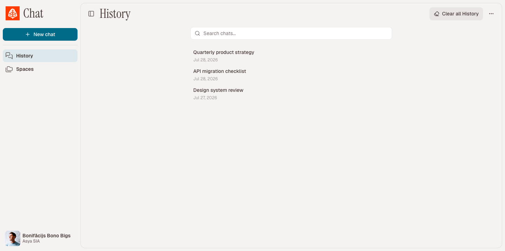

# Asya Chat UI (open-source ChatGPT shell)

Open source multi-provider LLM chat platform with organization management, model routing, tool execution, usage analytics, and OpenAI-compatible APIs alternative to Open WebUI and LibreChat.

Developed by [asya.ai](https://asya.ai) authors of https://eldigen.com (automated e-mail and document support system) and https://pitchpatterns.com (automated call centre analytics and robocalls)

## Screenshots

Empty chat:




Chat with attachments and tools:



Chat history:




## Roadmap

- [X] UX improvements (larger visuals, left side panel CSS)
- [x] UX button to enable/disable Web Search (DuckDuckGo & Perplexity API)
- [x] Function to share public chat
- [ ] Group chats (groups that see each other chats)
- [ ] … Add your own feature requests in Github Issues

## License

This project is released under **GNU GPL v3.0**. See `LICENSE` for the full text.

## What This Project Does

`asya-chat-ui` is a full-stack chat application that supports:

- multi-organization and role-based access (`super_admin`, org admins, members)
- model management per organization (enable/disable models and providers)
- multiple provider backends (OpenAI, Azure OpenAI, Gemini, Groq, Anthropic, OpenRouter, Vertex)
- streaming chat generation with resumable task events and parallel tool calling
- RAG projects (document sources, embeddings, retrieval) that can be attached to chats
- user memories, chat search, chat sharing via public link, and incognito (ephemeral) chats
- org-level data retention policies for chats and files
- built-in tools for web search/scraping, code execution, PDF, time, memory, and image generation/editing
- OpenAI-compatible API endpoints (`/v1/models`, `/v1/chat/completions`, `/v1/responses`, `/v1/embeddings`)
- OIDC SSO, login-domain → org mapping, and UI localization (English, Japanese, Latvian)
- usage tracking by model/user/org/month

## Architecture

The stack is split into services orchestrated with Docker Compose:

- `nginx`: serves the frontend build and proxies `/api/*` to backend
- `backend`: FastAPI app for auth, chat APIs, org/model config, projects/agents, usage, and OpenAI compatibility
- `migrate`: one-shot Alembic migration runner before API/worker start
- `worker`: Celery worker for async chat generation tasks
- `beat`: Celery beat scheduler (incognito cleanup, org retention cleanup)
- `postgres`: primary relational data store
- `redis`: broker/result backend for Celery task orchestration
- `scraper`: Puppeteer + Readability microservice used by web tools
- `dind`: Docker-in-Docker engine used to run sandboxed code execution containers
- `executor` (profile `exec`): image build target for Python code execution runtime

Compose files:

- `docker-compose.yml` (+ optional `docker-compose.override.yml`) — local build/dev
- `docker-compose.prod.yml` — production deploy from Docker Hub images (`asyaai/asya-chat-ui-*`)

## Request and Generation Flow

### 1) User interaction

- Frontend (React + Vite) sends requests to `/api/...` (REST) and `/api/chats/{chat_id}/ws` (WebSocket).
- `nginx` rewrites `/api/*` and forwards to FastAPI.

### 2) Chat creation and streaming

- User message is saved in Postgres (skipped for lasting history when the chat is incognito).
- Backend creates a generation task and assistant placeholder message.
- Worker runs a LangChain-based agentic loop: provider calls, parallel tool execution, and optional RAG retrieval from attached projects.
- Worker emits ordered generation events (`activity`, `tool_event`, `delta`, `done`, `error`) into DB.
- Frontend consumes real-time events over WebSocket; falls back to polling task events when needed.
- Long chats can be summarized when they approach context limits.

### 3) Tool execution

- **Web tools** call scraper service for search/scrape or screenshots (DuckDuckGo; Perplexity when configured).
- **Code execution tool** writes inputs/outputs under `data/files`, then runs code in an isolated container via `dind`.
- **PDF / image / memory / project tools** enrich answers from attachments, user memory, or indexed project sources.

### 4) Usage accounting and retention

- Every generation (and embedding/image operation) writes token and usage metadata into `UsageEvent`.
- Usage endpoints aggregate data by model/user/org/month.
- Celery beat applies org retention settings and cleans up expired incognito chats.

## Repository Layout

- `frontend/` - React app UI (chat, projects, settings, auth, usage pages)
- `backend/app/` - FastAPI APIs, provider adapters, LangChain runtime, tools, worker logic, models
- `backend/alembic/` - database migrations
- `backend/executor/` - Python sandbox image used by code execution
- `scraper/` - Node.js headless browser scraping service
- `nginx/` - reverse proxy and static hosting config
- `docker-compose.yml` - core service topology
- `docker-compose.override.yml` - development overrides (hot reload + frontend dev server)
- `docker-compose.prod.yml` - production stack using published images

## Operations Documentation

For setup and maintenance, use these docs:

- [Setup guide](docs/setup.md)
- [Environment variables and configuration reference](docs/configuration.md)
- [Maintenance runbook](docs/maintenance.md)
- [Wiki publishing guide](docs/wiki-publish.md)

## Configuration

1. Copy environment template:

```bash
cp .env.example .env
```

2. Set required values at minimum:

- `JWT_SECRET`
- database values (`DATABASE_URL` or `POSTGRES_*`)
- at least one provider key (`OPENAI_API_KEY`, `GEMINI_API_KEY`, `ANTHROPIC_API_KEY`, etc.)

3. Optional but commonly used:

- SMTP values for invite/password reset emails
- org-level super admin bootstrap (`SUPER_ADMIN_EMAILS`)
- `PERPLEXITY_API_KEY` for Perplexity-backed search
- `AGENT_EMBEDDING_MODEL` (default `BAAI/bge-m3`) for project RAG embeddings
- execution limits (`EXEC_*`) and attachment limits
- `WORKER_REPLICAS` to scale Celery workers

## Running with Docker Compose

### Default local development

```bash
docker compose up --build
```

This uses `docker-compose.override.yml` automatically, enabling:

- backend auto-reload
- frontend dev server on `http://localhost:5173`

Main app URL through nginx: `http://127.0.0.1:8085`

### Core stack only (without override)

```bash
docker compose -f docker-compose.yml up --build
```

In this mode, nginx serves the production frontend build bundled in its image.

### Production (Docker Hub images)

```bash
cp .env.example .env
# set JWT_SECRET, POSTGRES_PASSWORD, and provider keys
docker compose -f docker-compose.prod.yml up -d
```

Images (override tag with `CHATUI_TAG`):

- `asyaai/asya-chat-ui-backend`
- `asyaai/asya-chat-ui-web`
- `asyaai/asya-chat-ui-scraper`
- `asyaai/asya-chat-ui-executor`

Bind address/port defaults: `127.0.0.1:8085` (`CHATUI_BIND_ADDRESS`, `CHATUI_PORT`).

To build and push a new release to Docker Hub, see [docs/docker-hub-publish.md](docs/docker-hub-publish.md).

### Python execution image (dind)

Code execution runs containers via the `dind` service, which has its own Docker daemon.
Building on the host does not make the image visible there.

On first local `docker compose up`, `executor-bootstrap` builds `chatui-python-exec:latest`
inside dind automatically. After changing files under `backend/executor/`, rebuild with:

```bash
docker compose run --rm executor-bootstrap
```

Or manually inside dind:

```bash
docker compose exec dind docker build -t chatui-python-exec:latest /executor
```

In production compose, `executor-bootstrap` pulls `asyaai/asya-chat-ui-executor` and tags it for dind instead of building locally.

## Key API Surfaces

- Auth and account: `/auth/*`
- API keys: `/api-keys/*`
- Orgs and provider configuration: `/orgs/*`
- Models and model suggestions: `/models/*`
- Projects / RAG agents and sources: `/agents/*`
- Chats, messages, generation tasks/events, sharing, WebSocket stream: `/chats/*`
- Usage aggregation: `/usage/*`
- OpenAI-compatible endpoints: `/v1/*`
- Health check: `/healthz`

## Security and Safety Boundaries

- Scraper blocks private/loopback/internal IP destinations.
- Code execution runs in isolated containers with:
  - dropped capabilities
  - read-only root filesystem
  - cpu/memory/pids/ulimit caps and a private sized `/tmp` tmpfs
  - timeout and output-size caps
  - symlink-safe output collection (regular files only)
  - import allowlist guidance for models (enforcement is the sandbox)
- Auth uses JWT with periodic token refresh through response header.
- Provider access can be disabled globally per org and overridden per org config.
- Incognito chats are excluded from lasting history/share and cleaned up on a schedule.
- Org retention policies purge old chats and files via Celery beat.

## Development Notes

- Frontend package manager: `pnpm`
- Backend package manager/runtime tooling: `uv`
- Database migrations: Alembic (`uv run alembic upgrade head`)
- Run backend tests: `make test` (or `cd backend && uv run pytest`)
- Backend health endpoint: `GET /healthz`
- Scraper health endpoint: `GET /healthz` on scraper service
- UI locales live under `frontend/src/locales/` (`en`, `ja`, `lv`)

## Attribution

This project is developed and maintained by [asya.ai](https://asya.ai), and published as open source at [asya-ai/asya-chat-ui](https://github.com/asya-ai/asya-chat-ui) under GPLv3.
